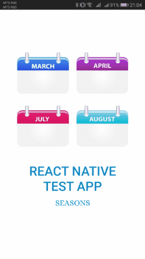

Описание хода работы:
1) Установлены следующие инструменты для работы:
- IDE WebStorm (+Использован AndroidSDK из Android Studio для запуска приложения)
- Node.js and NPM
- Watchman (Этот инструмент рекомендуется в процессе установки для повышения производительности. Он следит за файловой системой и реагирует на изменения)
- Yarn (Предлагается в процессе создания и запуска приложения React Native)
- react-native-cli (Устанавливается React Native c помощью NPM и добавляется в глобальную установку)
2) Создан бланк приложения React Native, протестирован на устройстве с Android 9.0, решены проблемы возникшие на первых запусках.
3) Создан прототип приложения (используя сервис figma) https://www.figma.com/file/14vadjLNHzQXG46Pr2g8x0/TestReactNativeApp4NorNick?node-id=0%3A1

4) Подготовлена структура приложения и главный экран
5) Создан back-end и установлено соединение с ним. По 1 запросу загружается приветствие, дата и картинка месяца.

=> В процессе: добавление экзепшенов на некорректные ответы от сервера
